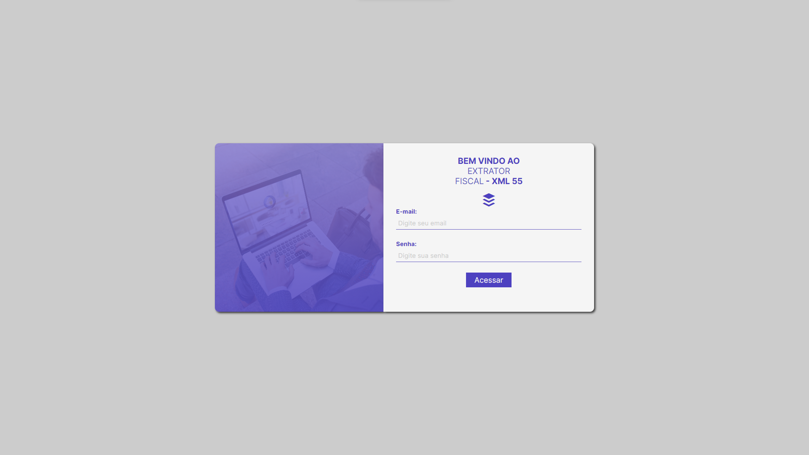
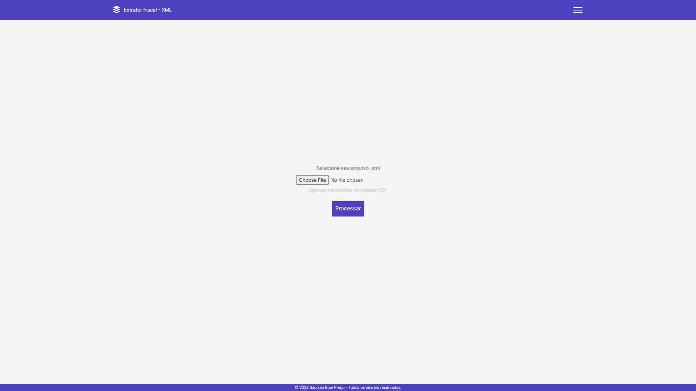
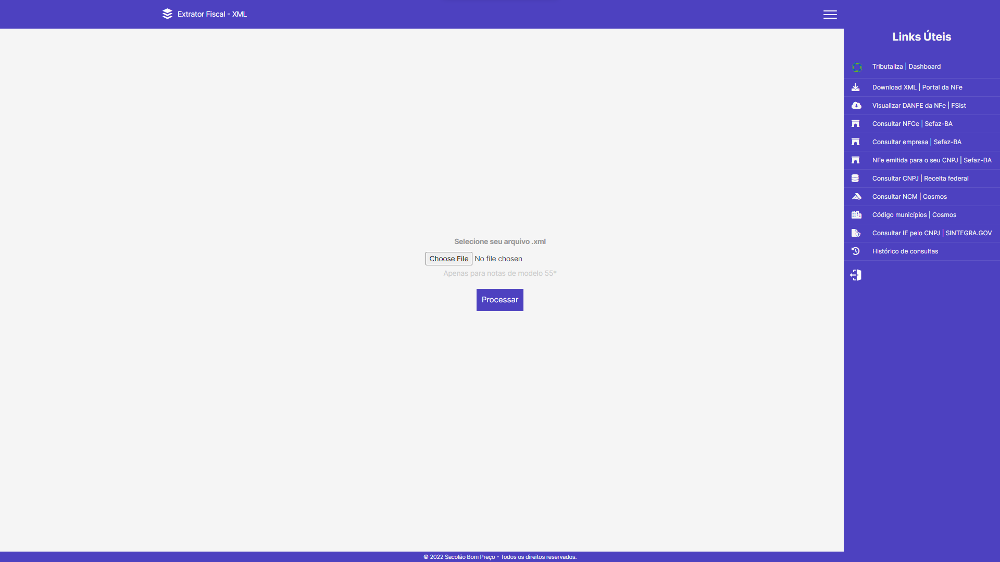
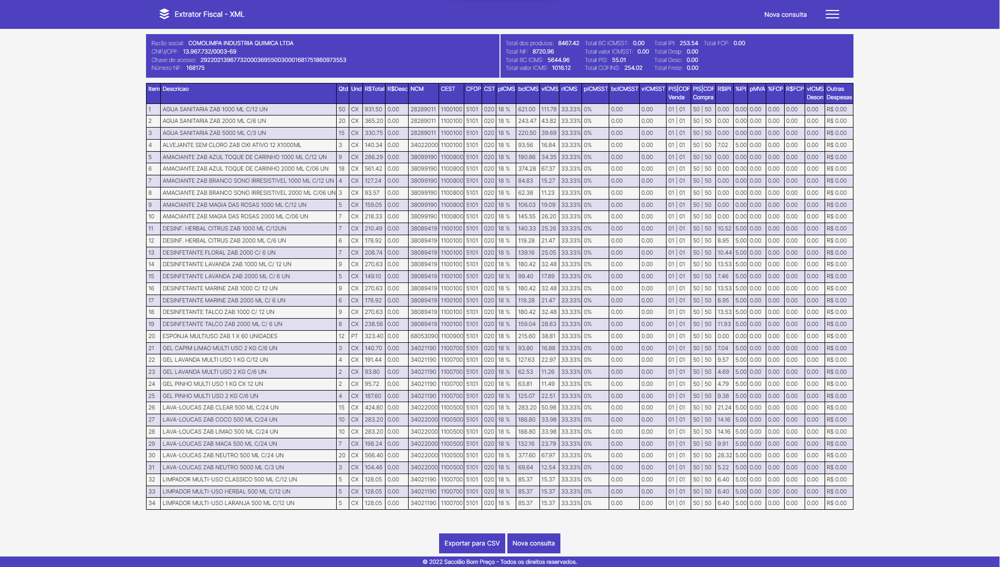

<h1 align="center" style="color: #f1f1f1f1">
	Extrator Fiscal - XML
</h1>

created Project for extraction data of XML.

<hr/>

### 🚀 Starting

For using this application, you need that the back-end is running in your PC.<br/>

<hr/>

### 🔧 Usage

Access this link for viewer front-end of application: [click here](https://extrator-xml.netlify.app/)

**The app run only if exist a backend inside your pc.**

<br>

For more infos about project, talk to me:

```
[E-mail]: marcelo.dev.js@hotmail.com

[LinkedIn]: https://www.linkedin.com/in/marcelo-ribeiro-da-silva-aa444921b/
```

<hr/>

## 🛠️ Built with

Technologies used in this project

- [Javascript](https://developer.mozilla.org/pt-BR/docs/Web/JavaScript) -
- [Java - SpringBoot](https://spring.io/projects/spring-boot)
- [Bootstrap](https://getbootstrap.com/)
- [FontAwesone](https://fontawesome.com/)
<hr/>

## 🖇️ COllaborating

Please, collaborate with project. I would be very happy.

Thanks. 👋🚀

<hr/>

## 📌 Version

I'm used the Git/Hub for controller of version is this project. All commits and all alterations, they are here.

<hr/>

## ✒️ Authors

- **Marcelo Silva** - _Front-End_ - [ GitHub Profile](https://github.com/EuMarcel0)
- **Uilquer Dourado** - _Back-End_ - [ GitHub Profile](https://github.com/DouradoUilquer)
<hr/>

## 📄 License

This project is open source.

<hr/>

## 🎁 Expression of gratitude

I'm very, very happy for concluded this project. 🚀👋

<hr/>

## 💻 Prints of app





